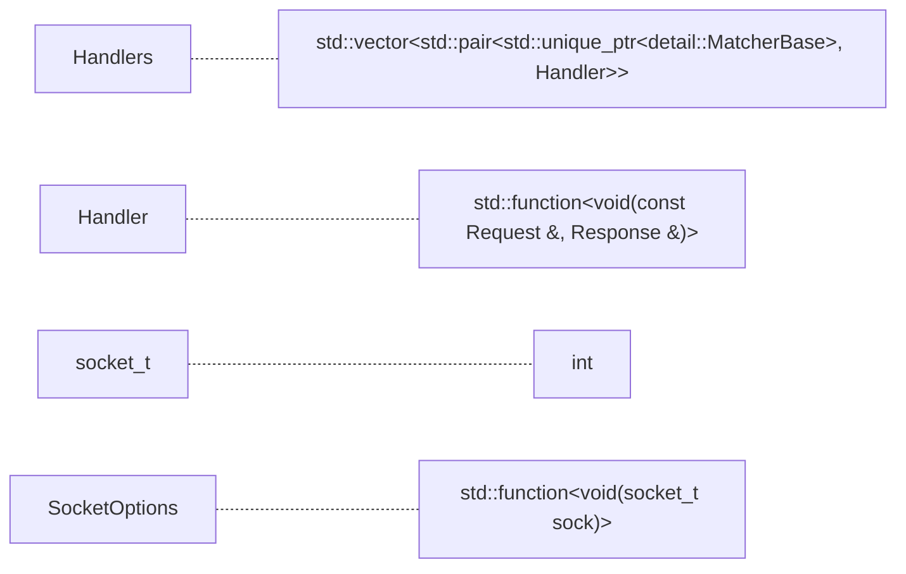
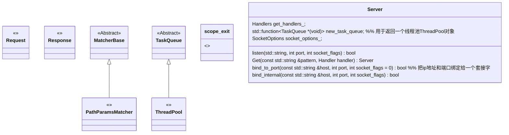
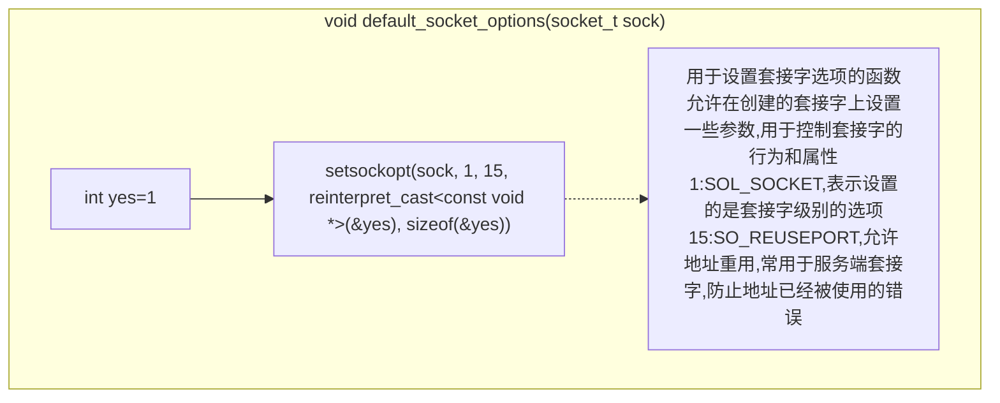
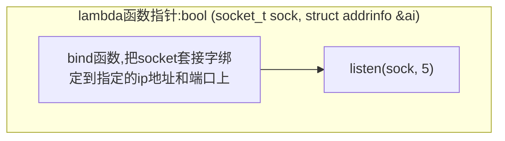
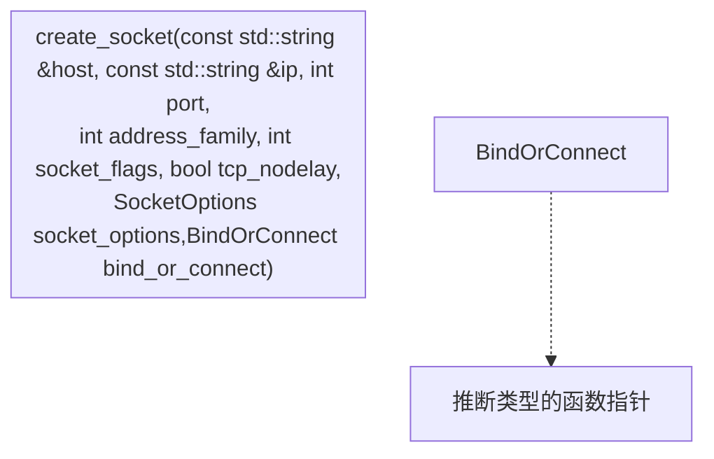
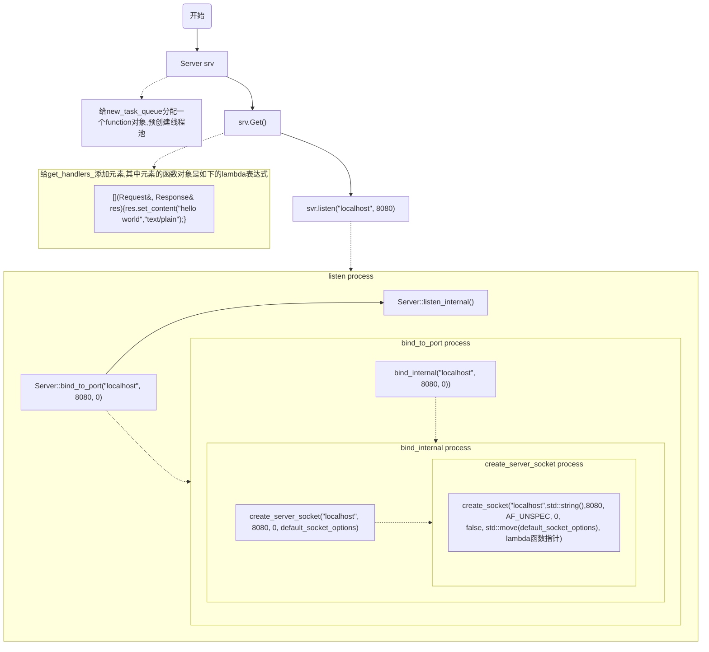

+ socket地址
  + 通用socket地址(16字节)
    + ```C++ 
        struct sockaddr {
            __uint8_t sa_len;
            sa_family_t sa_family;
            char sa_data[14];
        }    
        
        ```


# UML类图





# 流程图








